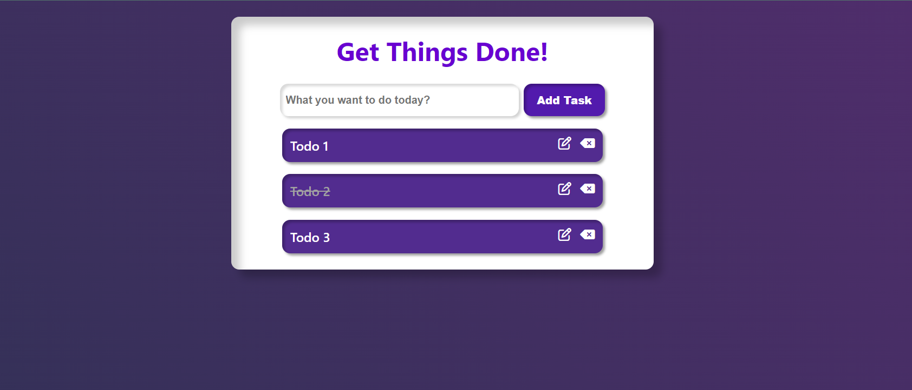

# Todo App with React.js [](https://shuhaib-t.github.io/)

## Overview

A simple Todo App built using React.js where users can add, edit, mark as completed, and delete tasks.

## Table of Contents

- [Demo](#demo)
- [Features](#features)
- [Installation](#installation)
- [Usage](#usage)
- [Folder Structure](#folder-structure)
- [Contributing](#contributing)
- [License](#license)

## Demo

<p align="center">
  
</p>

## Features

- Add new tasks
- Edit existing tasks
- Mark tasks as completed
- Delete tasks
- Responsive design

## Installation

1. Clone the repository:

```bash
git clone https://github.com/SHUHAIB-T/todo-app-react.git
cd todo-app-react
```

2. Install dependencies:

```bash
npm install
```

3. Usage:

```bash
npm run dev
```

Open your browser and visit http://localhost:5173 to use the Todo App.

## Contributing

Contributions are welcome! Please follow the contribution guidelines.

## License

This project is licensed under the MIT License.
